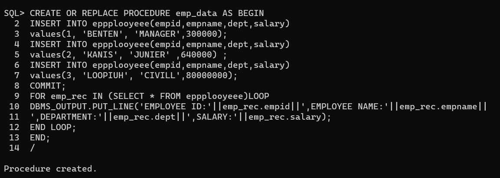

# Ex. No: 4 Creating Procedures using PL/SQL

### AIM: To create a procedure using PL/SQL.

### Steps:
1. Create employee table with following attributes (empid NUMBER, empname VARCHAR(10), dept VARCHAR(10),salary NUMBER);
2. Create a procedure named as insert_employee data.
3. Inside the procdure block, write the query for inserting the values into the employee table.
4. End the procedure.
5. Call the insert_employee data procedure to insert the values into the employee table.
6. Display the employee table

### Program:
```
CREATE TABLE epl(
empid NUMBER,
empname VARCHAR(19),
dept VARCHAR(10),
salary NUMBER

);


CREATE OR REPLACE PROCEDURE emp_data AS BEGIN

INSERT INTO epl(epmid,empname,dept,salary)

values(1, 'Swetha', '"MD',10000000) ;

INSERT INTO epl(epmid,empname,dept,salary)

values(2, 'Anitha’, "HR" ,500000) ;

INSERT INTO epl(epmid,empname,dept,salary)

values(3, 'Divya‘, 'IT',200000);

COMMIT;

FOR emp_rec IN (SELECT * FROM epl)LOOP

DBMS_OUTPUT.PUT_LINE('EMPLOYEE ID:'||emp_rec.empid]||",EMPLOYEE
NAME: ' | |emp_rec.empname||',DEPARTMENT' | |emp_rec.dept]||',SALARY:" | |emp_rec.salary);

END LOOP;

END;

/

```
### Output:




### Result:
Thus the procedure has been successfully created in PI/SQL.
